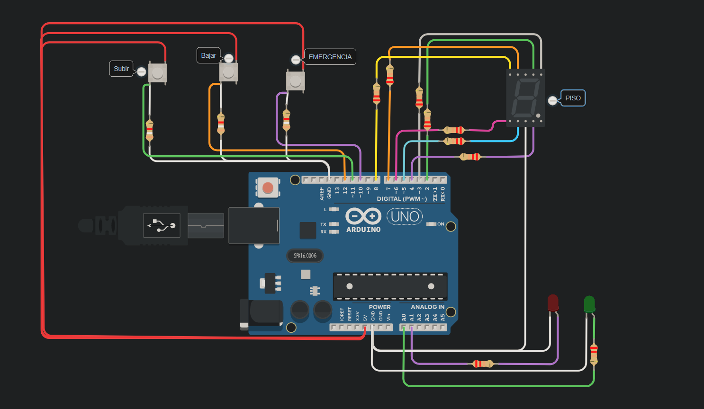

## ALUMNO

* Figueroa Fernando

## Proyecto:Parcial Numero 1



## DESCRIPCION

Se nos pide armar un modelo de montacarga funcional como maqueta para un hospital. El
objetivo es implementar un sistema que pueda recibir ordenes de subir, bajar o pausar
desde diferentes pisos y muestre el estado actual del montacargas en el display 7 segmentos.

## Funcion Display 7 Segmentos :smiling_imp:

```
byte numeroDisplay[10][7]= //matriz de 10 filas (numeros) x 7 filas(led)
{	
  {1,1,1,1,1,1,0},//Numero 0
  {0,1,1,0,0,0,0},//numero 1
  {1,1,0,1,1,0,1},//numero 2
  {1,1,1,1,0,0,1},//numero 3
  {0,1,1,0,0,1,1},//numero 4
  {1,0,1,1,0,1,1},//numero 5
  {1,0,1,1,1,1,1},//numero 6
  {1,1,1,0,0,0,0},//numero 7
  {1,1,1,1,1,1,1},//numero 8
  {1,1,1,0,0,1,1}//numero 9
};
```
El numero que se muestra en el **display 7 segmentos** es el piso en el que se encuentra el montacarga.

Declaro una matriz tipo byte de 10 filas x 7 columnas,
cada fila como indica el comentario representa un Numero a prender en el display 7 segmento.
Los 1 y 0 son los estados del led,es decir, Si es 1 = HIGH, si es 0 = LOW.  

Para usar esta matriz y que me represente un numero en el display 7 segmentos utilizo la funcion :

```
void recorrerMatriz(int numeroAPrender)
{	
  for(int i=0 ; i< 7 ;i++)//FOR para recorrer la matriz
	{
  		digitalWrite(i+2,numeroDisplay[numeroAPrender][i]);
 	}
}
```

**void recorrerMatriz()** recibre por parametro un numero a prender como bien indica el nombre de la variable,lo que hace es: cuando la llamo en la funcion **void loop** le asigno a **numeroAPrender** un contador que representa un numero en el led.
En este caso cuando llega el valor de **numeroAPrender**  recorro con un for la funcion **void recorrerMatriz()** hasta que el loop sea menor a 7, cuando **i** llega a 5 le sumo 2 y mi **for** termina. En este caso **i** quedo con el valor de 7 y **numeroAPrender** con el que le pase el **loop()**.

Sabiendo esto,lo que hace la linea:

**`
digitalWrite(i+2,numeroDisplay[numeroAPrender][i]);
`**

Primero va a la funcion **numeroDisplay** y busca en la fila el numero que se le asigno. Ej: Si se le asigno un 0 va a buscar la fila 0.
Solamente con esto mi **display 7 segmento** no prenderia, por eso luego le paso **i** que siempre va a ser 7.
Con el ejemplo anterior seria: primero buca la fila 0 y recorre 7 columnas, lo cual en este caso prenderia el numero 0.
TIP:el numero que representa **numeoAPrender** es el que se va a mostrar en el **display 7 segmentos**.

## Funcion LOOP()
```
  // Leer el estado actual del botón
  int estadoSubir = digitalRead(11);
  int estadoBajar = digitalRead(12);
  int estadoEmergencia = digitalRead(10);	
```
Las variables: **estadoSubir, estadoBajar y estadoEmergencia** lo que hace es leer el estado del pulsador, es decir si oprimo el **boton** SUBIR la variable **estadoSubir** va tomar el valor de 1=HIGH,lo mismo pasa con las otras 2, cada una de estas variables estan asignadas para cada boton conectados al pin de cada caso.

Una ves presionado cualquier boton, la funcion **loop()** continua en las siguientes lineas de codigo: 
```
 //SUBIR
  if (estadoSubir == HIGH)
  {
    salida = 1;
    apagarSubir = LOW;
    nivelPrender = 2;
  	numeroAPrender = niveles(nivelPrender,salida,apagarSubir);
  }
  
  //BAJAR
  if (estadoBajar == HIGH)
  {
    salida = 1;
    apagarBajar = LOW;
    nivelPrender = 3;
    numeroAPrender = niveles(nivelPrender,salida,apagarBajar);
  } 
  
  //PRESIONAR SOLO EN CASO DE EMERGENCIA YA QUE EL LOOP NO SE VUELVE A REPETIR
  switch (estadoEmergencia)
  {
    case 1:
    loop(); //FINALIZO EL LOOP Y NO VUELVO A ENTRAR
  }
```

**estadoSubir** y **estadoBajar** cumplen un rol similar, Su unica diferencia es que una se usa para bajar y otra para subir de piso,en cambio **estadoEmergencia** se usa unicamente para emergencias, si se oprime este boton el montacargas no va a subir y no va a volver a bajar nunca mas.

Como vimos recien, cuando oprimo **estadoSubir** o **estadoBajar** su estado es HIGH, si se cumple la condicion se ejecutara una serie de asignaciones, pero la que mas interesa es:

**`
numeroAPrender = niveles(nivelPrender,salida,apagarBajar);
`**

en la variable **numeroAPrender** le asigno lo que me retorna la funcion **niveles()**.

Que hace dicha funcion?

```
int niveles(int nivelPrender, int estadoSalida,int estado)
{
      if (estadoSalida == 1 && estado == 0)
          {
             digitalWrite(ledRojo,LOW);
             digitalWrite(ledVerde,HIGH);
             delay(3000);
                if (nivelPrender == 2)// 2 = SUBIR
                {
                    if (contador == 9)
                    {
                      contador = 9;
                      digitalWrite(ledVerde,LOW);
                      digitalWrite(ledRojo,HIGH);
                    }
                    else
                    {
                      contador++;
                    }
                }
        
               else	if(nivelPrender == 3) //3 = BAJAR
                {
                  if (contador == 0)
                  {
                    contador = 0;
                    digitalWrite(ledVerde,LOW);
                    digitalWrite(ledRojo,HIGH);
                  }
                  else 
                  {
                   contador--;
                  }
              	}
         	 Serial.println(contador);	
             estadoSalida = 0;
             digitalWrite(ledRojo,HIGH);
             digitalWrite(ledVerde,LOW);	
          }
  
return contador;
}
```

Esta funcion recibe 3 parametros: **nivelPrender ,estadoSalida y estado**.

**nivelPrender**: Es el boton que el usuario oprimio, Es decir, si oprimio el boton de subir lo comparo con el numero 2, si se cumple la condicion sube de piso. A dicho parametro lo asigno el valor en el loop() dependiendo el boton presionado.

**estadoSalida**: Es el estado en que se encuentra el boton, lo comparo con 1(HIGH) porque si esta en 0(LOW) no necesito que suba o baje entonces no entra a la funcion. 

**estado**: Es un seguro de antirebote del pulsador


Continuando con la funcion,si: **nivelPrender** es == 2 el montacargas va subir, es por eso que uso el  **`contador++`** para que lo devuelva y lo asigne en la variable **numeroAPrender** en el loop() y asi a esta variable lo asigne en: 

**`recorrerMatriz(numeroAPrender);`**

y que me recorra lo antes ya explicado mas arriba en la seccion: **Funcion Display 7 Segmentos**.
La misma asignacion va a hacer si **nivelPrender** == 3, solamente que en este el montacargas no sube de piso, sino que hace totalmente lo contrario.


## LINK TINKERCARD :eyes:

**https://www.tinkercad.com/things/6oszydiP1YU**


